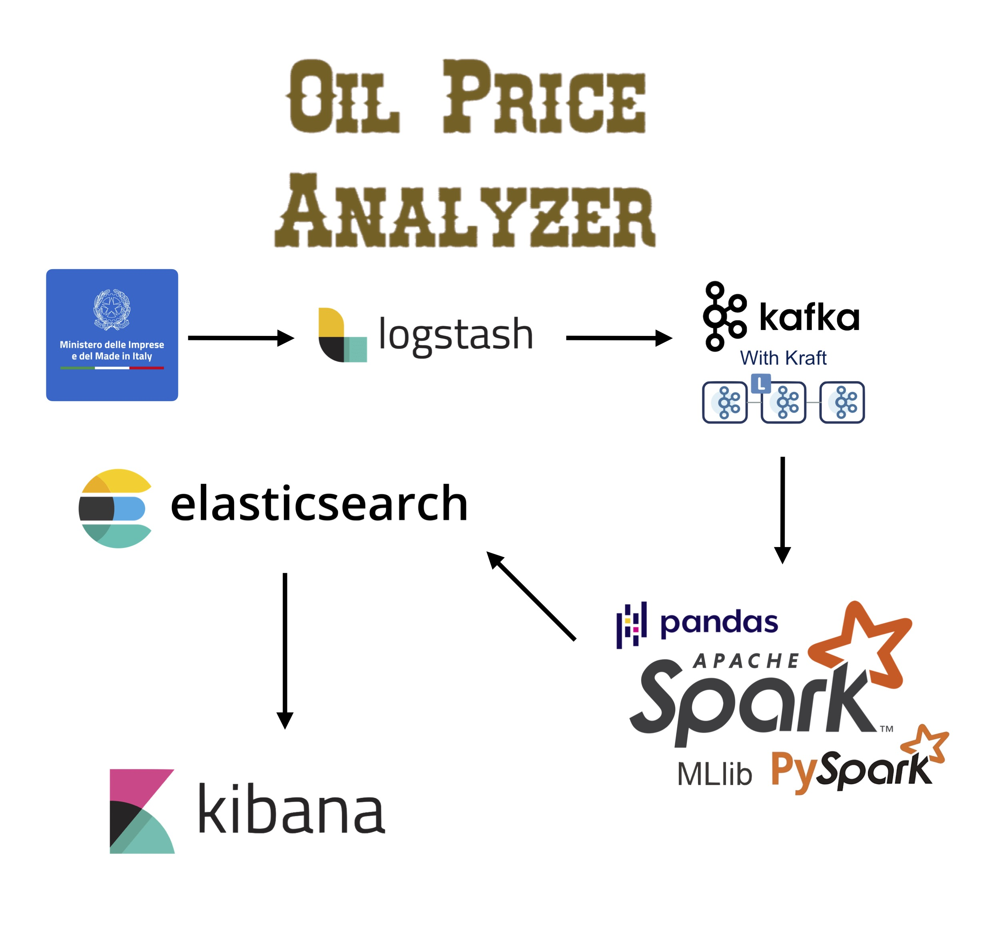

<br><br>
<div align="center"></div>
<br><br><br>

# Introduction
This is a Technologies for Advanced Programming project that aims to visualize and predict the price of oil, based on the history of the station's price.

<br>

## Software Used
<ul>
    <li> <strong>Logstash using the Http Poller plugin </strong> </li>
    <li> <strong>Kafka with KRaft</stronb>
    <li> <strong>Apache Spark with MLib and Pandas</strong> </li>
    <li> <strong>ElasticSearch</strong> </li>
    <li> <strong>Kibana</strong</li>
</ul>

<br>

## Explanation
Each day in the morning, the Italian Minister "Ministero delle Imprese e del made in Italy" publishes the price of oil for each station in Italy. The data is published in a CSV format and is available at this <a href="https://www.mimit.gov.it/images/exportCSV/prezzo_alle_8.csv">link</a>.
The pipeline fetches the data using the Logstash's Http Poller plugin and sends it to Kafka. Then, Spark consumes the data from Kafka and processes it. The processed data will be sent to ElasticSearch and will be visualized using Kibana. In particular, Spark uses a Linear Regression model to predict the price of oil for the next day: each oil station has its own model, trained on the history of the station's price (based on the past two quarters). Each station's dataset is updated every day with new data, and the model is retrained.

<br>

## How to run the project
You can download the archive of the past two quarters from the <a href="https://www.mimit.gov.it/it/open-data/elenco-dataset/carburanti-archivio-prezzi">link</a> and put it in the `./spark/code/PrezziRaw` folder. Then you can run the python script "splitImpianti.py" located in the `./spark/code/src/dataset` folder. This script will split the dataset into multiple files, one for each oil station. 

<br>

Now you can run the pipeline using the following command:
```
    docker-compose down && docker-compose up --build
```

<br>

## Dashboard

<div align="center"></div>
<div align="center"></div>

<br>

### Links Minister site
Homepage:
https://www.mimit.gov.it/index.php/it/open-data/elenco-dataset/carburanti-prezzi-praticati-e-anagrafica-degli-impianti

CSV Anagrafica Giornaliera:
https://www.mimit.gov.it/images/exportCSV/anagrafica_impianti_attivi.csv

CSV Prezzi Giornalieri:
https://www.mimit.gov.it/images/exportCSV/prezzo_alle_8.csv

Archivio dataset Training:
https://www.mimit.gov.it/it/open-data/elenco-dataset/carburanti-archivio-prezzi

